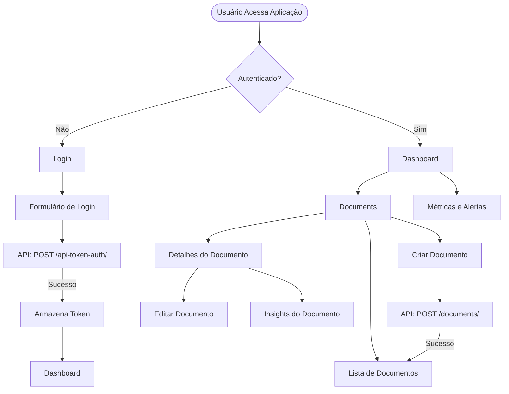
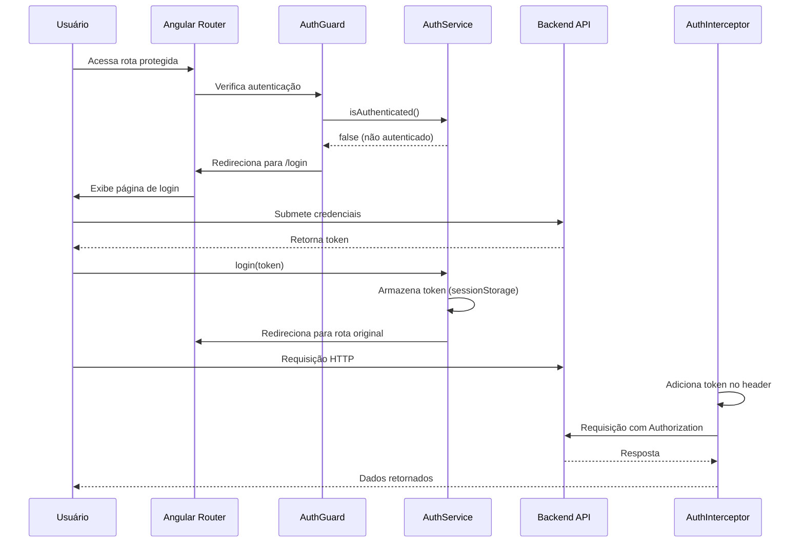
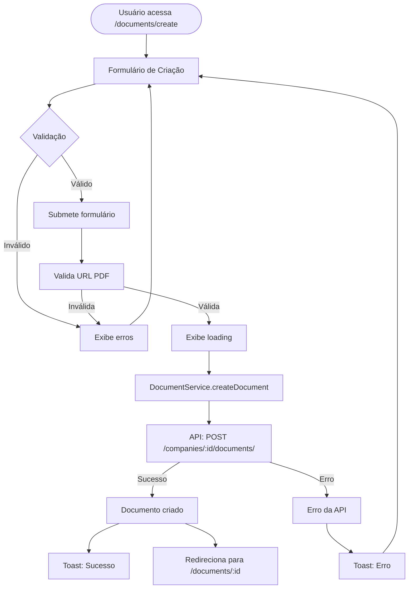
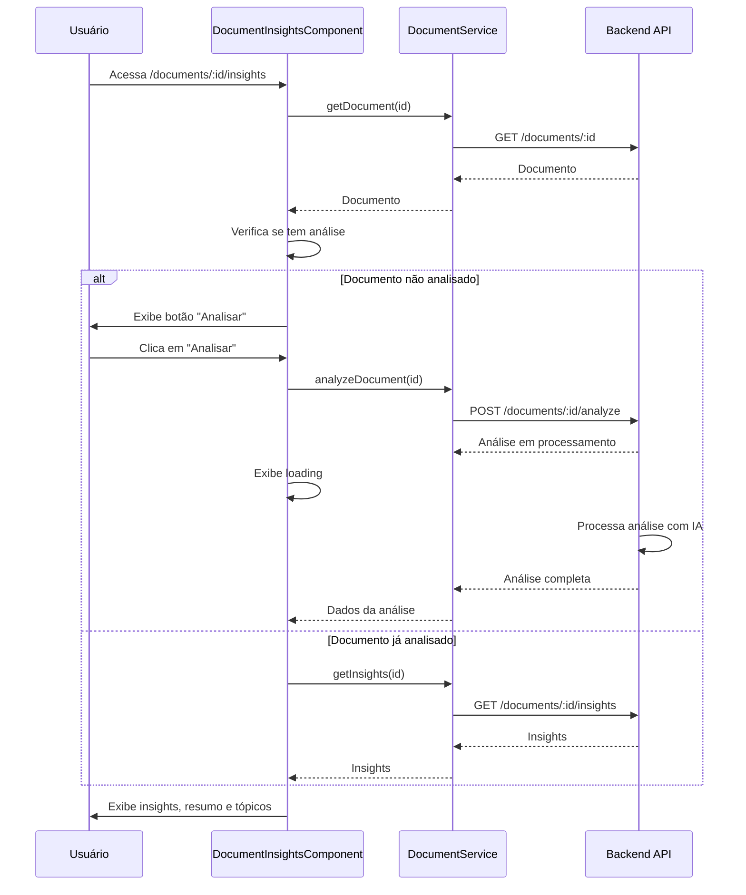
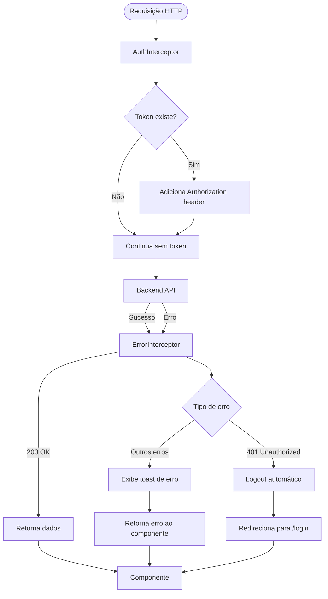

# ZapSign Frontend

## 📋 Resumo Executivo

Aplicação frontend desenvolvida em Angular 21 para gerenciamento de documentos e assinaturas digitais, integrada com a API ZapSign. A interface oferece uma experiência fluida e moderna, permitindo que empresas clientes gerenciem documentos, visualizem métricas, recebam alertas e obtenham insights automáticos sobre seus contratos através de análise com IA.

### Principais Funcionalidades

- ✅ **Interface Fluida**: Navegação sem reload de página (SPA)
- ✅ **CRUD Completo**: Gerenciamento completo de documentos e signatários
- ✅ **Dashboard Interativo**: Métricas, alertas e gráficos em tempo real
- ✅ **Análise com IA**: Visualização de insights e análise inteligente de documentos
- ✅ **Autenticação Segura**: Sistema de login com tokens e proteção de rotas
- ✅ **Design Moderno**: Interface responsiva com PrimeNG
- ✅ **Testes Automatizados**: Cobertura de testes com Vitest

## 🚀 Links de Produção

- **Aplicação em Produção**: https://zapsign-front1.onrender.com
- **API Backend**: https://zapsign-api.onrender.com
- **Documentação da API**: https://zapsign-api.onrender.com/api/schema/swagger-ui/

## 🛠️ Tecnologias Utilizadas

### Framework e Core
- **Angular 21.0**: Framework principal
- **TypeScript 5.9**: Linguagem de programação
- **RxJS 7.8**: Programação reativa
- **Angular Signals**: Gerenciamento de estado reativo

### UI e Estilização
- **PrimeNG 21.0.2**: Biblioteca de componentes UI
- **PrimeIcons 7.0**: Ícones
- **Chart.js 4.5.1**: Gráficos e visualizações
- **SCSS**: Pré-processador CSS

### Testes
- **Vitest 4.0**: Test runner moderno
- **@vitest/ui**: Interface para testes
- **@vitest/coverage-v8**: Cobertura de código
- **jsdom**: Ambiente de testes DOM

### Build e Deploy
- **Angular CLI 21.0**: Ferramentas de build
- **@angular/build**: Novo builder do Angular
- **Render**: Plataforma de deploy

## 📦 Configuração Local

### Pré-requisitos

- Node.js 20.x ou superior
- npm 11.6.2 ou superior

### 1. Clone o Repositório

```bash
git clone <repository-url>
cd zapsign_front
```

### 2. Instale as Dependências

```bash
npm install
```
### 3. Configure Variáveis de Ambiente

O projeto usa arquivos de ambiente. Para desenvolvimento local, o arquivo `src/environments/environment.ts` já está configurado:

```typescript
export const environment = {
  production: false,
  apiUrl: 'http://localhost:8000/api',
  defaultCompanyId: 1
};
```

Para produção, o arquivo `src/environments/environment.production.ts` está configurado para usar a API em produção.

### 4. Execute o Servidor de Desenvolvimento

```bash
npm start
# ou
npm run dev
```

A aplicação estará disponível em: `http://localhost:4200`

### 5. Build para Produção

```bash
npm run build
```

Os arquivos compilados estarão em `dist/zapsign_front/browser/`

## 🔄 Fluxo da Aplicação

### Fluxo de Navegação



### Fluxo de Autenticação



### Fluxo de Criação de Documento



### Fluxo de Análise de Documento



### Fluxo de Interceptação HTTP



## 🏗️ Estrutura do Projeto

```
src/
├── app/
│   ├── core/                    # Funcionalidades core (singleton)
│   │   ├── guards/             # Guards de rota (AuthGuard)
│   │   ├── interceptors/       # Interceptors HTTP
│   │   └── services/           # Serviços core (Auth, Company, Document, Notification)
│   │
│   ├── features/               # Módulos de funcionalidades
│   │   ├── auth/               # Autenticação
│   │   │   └── components/
│   │   │       └── login/      # Componente de login
│   │   │
│   │   ├── dashboard/          # Dashboard principal
│   │   │   ├── components/
│   │   │   │   ├── alerts-list/        # Lista de alertas
│   │   │   │   ├── metrics-cards/      # Cards de métricas
│   │   │   │   └── metrics-charts/     # Gráficos de métricas
│   │   │   └── dashboard.routes.ts
│   │   │
│   │   └── documents/          # Gerenciamento de documentos
│   │       ├── components/
│   │       │   ├── document-create/    # Criar documento
│   │       │   ├── document-detail/    # Detalhes do documento
│   │       │   ├── document-edit/      # Editar documento
│   │       │   ├── document-insights/   # Insights e análise
│   │       │   └── document-list/       # Lista de documentos
│   │       └── documents.routes.ts
│   │
│   ├── layout/                 # Componentes de layout
│   │   └── components/
│   │       ├── header/         # Cabeçalho
│   │       ├── main-layout/    # Layout principal
│   │       ├── notification-toast/  # Notificações
│   │       └── sidebar/       # Barra lateral
│   │
│   ├── shared/                 # Componentes e utilitários compartilhados
│   │   ├── components/         # Componentes reutilizáveis
│   │   │   ├── loading/        # Loading spinner
│   │   │   ├── pdf-url-validator/  # Validador de URL PDF
│   │   │   └── status-badge/   # Badge de status
│   │   ├── models/             # Modelos TypeScript
│   │   ├── pipes/              # Pipes customizados
│   │   └── utils/              # Utilitários
│   │
│   ├── app.routes.ts           # Rotas principais
│   └── app.config.ts           # Configuração da aplicação
│
├── environments/               # Configurações de ambiente
│   ├── environment.ts          # Desenvolvimento
│   └── environment.production.ts  # Produção
│
├── tests/                      # Fixtures e mocks para testes
│   ├── fixtures/
│   └── mocks/
│
└── styles.scss                 # Estilos globais
```

### Arquitetura

O projeto segue uma **arquitetura baseada em features**, organizando o código por funcionalidades:

- **Core**: Funcionalidades singleton (serviços, guards, interceptors)
- **Features**: Módulos independentes por funcionalidade (auth, dashboard, documents)
- **Shared**: Componentes, modelos e utilitários compartilhados
- **Layout**: Componentes de estrutura da aplicação

## 🎯 Funcionalidades Principais

### Autenticação

- **Login**: Autenticação via token
- **AuthGuard**: Proteção de rotas autenticadas
- **AuthInterceptor**: Adição automática de token nas requisições
- **ErrorInterceptor**: Tratamento centralizado de erros HTTP

### Dashboard

- **Métricas**: Cards com estatísticas de documentos
- **Gráficos**: Visualizações com Chart.js
- **Alertas**: Lista de alertas importantes
- **Atualização em tempo real**: Dados atualizados via API

### Gerenciamento de Documentos

- **Listagem**: Tabela paginada com filtros
- **Criação**: Formulário completo com validação
- **Edição**: Edição inline de documentos
- **Detalhes**: Visualização completa com signatários
- **Exclusão**: Confirmação antes de excluir

### Análise de Documentos

- **Insights**: Visualização de análise com IA
- **Resumo**: Resumo automático do documento
- **Tópicos Faltantes**: Lista de tópicos que podem estar faltando
- **Análise sob demanda**: Botão para solicitar nova análise

### Layout Responsivo

- **Sidebar**: Navegação principal
- **Header**: Cabeçalho com informações do usuário
- **Notificações Toast**: Feedback visual de ações
- **Design Responsivo**: Adaptável a diferentes tamanhos de tela

## 🧪 Executando Testes

### Executar Todos os Testes

```bash
npm test
```

### Executar em Modo Watch

```bash
npm run test:watch
```

### Executar com Interface UI

```bash
npm run test:ui
```

### Executar com Cobertura

```bash
npm run test:coverage
```

### Executar em CI

```bash
npm run test:ci
```

## 🚀 Build e Deploy

### Build para Produção

```bash
npm run build
```

O build otimizado será gerado em `dist/zapsign_front/browser/`

### Deploy no Render

O projeto está configurado para deploy automático no Render via `render.yaml`:

```yaml
static_sites:
  - name: zapsign-front
    buildCommand: npm ci --legacy-peer-deps && NODE_OPTIONS='--max-old-space-size=512' npm run build
    publishPath: ./dist/zapsign_front/browser
```

### Variáveis de Ambiente no Render

- **NODE_VERSION**: `20.x`
- **NODE_OPTIONS**: `--max-old-space-size=512`
- **API_URL**: `https://zapsign-api.onrender.com/api`

### Otimizações Aplicadas

- **Source maps desabilitados** em produção
- **Tree shaking** automático
- **Code splitting** por rotas (lazy loading)
- **Minificação** de CSS e JavaScript
- **Otimização de imagens**


## 📝 Scripts Disponíveis

```bash
# Desenvolvimento
npm start          # Inicia servidor de desenvolvimento
npm run dev        # Inicia servidor e abre no navegador

# Build
npm run build      # Build para produção
npm run build:render  # Build otimizado para Render

# Testes
npm test           # Executa testes uma vez
npm run test:watch # Executa testes em modo watch
npm run test:ui    # Abre interface UI do Vitest
npm run test:coverage  # Executa testes com cobertura
npm run test:ci    # Executa testes para CI

# Outros
npm run watch      # Build em modo watch
```

---
